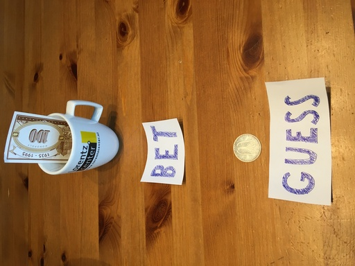

> Smart Contracts are not contracts and not smart. 
> -- Wolfgang Ahrendt 

## Introduction

On this page, we introduce the example case of casino implemented as
a Smart Contract on the blockchain. This example was prepared by
Wolfgang Ahrendt for discussion in September 2021, and also bases on
Gordon Pace.

The casino offers a simple bet game. The casino operator places
a (hidden) secret (HEAD or TAIL) inside the contract. Then, a player
can challenge the casino by placing a bet, and guessing the secret. If
players win, their bet is doubled, otherwise the deposit is taken.
A play of the game is given in the next section. 

From a service oriented architecture, the casino is a component which
offers several services (or methods). 

## A Play





## State Space
The example models a Casino Game (and is due to Gordon Pace), encoded as
a Solidity smart contract.

There is 1 operator, and 1 player. 

State space of the game consists of:
- the `pot` (an integer value)
- the player's `bet` (an integer value)
- player's `guess` (head or tail)
- a hashed `secret` (an integer value), given by the casino operator. 
  By using a hash value, it is ensured that the secret stays is unchanged
  during a play and the player is not able to obtain whether it is head or tail.
  The least-significant digit defines whether it is head or tail. (Bit commitment
  scheme)
- the current player and the operator identified by their unique addresses.


## Solidity Contract

```solidity
contract Casino {

  address public operator;
  
  uint public pot;
  
  // The hashed number submitted by the operator
  bytes32 public hashedNumber;
  
  address public player;
  
  enum Coin { HEADS, TAILS }
  Coin guess;

  uint bet;

  // The state of the contract
  enum State { IDLE, GAME_AVAILABLE, BET_PLACED }
  State private state;
  
  // Create a new casino
  constructor() public {
    operator = msg.sender;
    state = IDLE;
    pot = 0;
    bet = 0;
  }
  
  // Add money to pot
  function addToPot() public payable {
    require (msg.sender == operator);
    pot = pot + msg.value;
  }
  
  // Remove money from pot
  function removeFromPot(uint amount) public {
    // no active bet ongoing:
    require (state != BET_PLACED);
    require (msg.sender == operator);
    operator.transfer(amount);
    pot = pot - amount;
  }
  
  // Operator opens a bet
  function createGame(bytes32 _hashedNumber) public {
    require (state == IDLE);
    require (msg.sender == operator);
    hashedNumber = _hashedNumber;
    state = GAME_AVAILABLE;
  }

  //caller syntax: contractaddress.placeBet(HEADS).value(1000 Wei)
  
  // Player places a bet
  function placeBet(Coin _guess) public payable {
    require (state == GAME_AVAILABLE);
    require (msg.sender != operator);
    require (msg.value <= pot);
    
    state = BET_PLACED;
    player = msg.sender;

    bet = msg.value;
    guess = _guess;
  }
  
  // Operator resolves a bet
  function decideBet(uint secretNumber) public {
    require (state == BET_PLACED);
    require (msg.sender == operator);
    require (hashedNumber == cryptohash(secretNumber));
    
    Coin secret = (secretNumber % 2 == 0)? HEADS : TAILS;
    
    if (secret == guess) {
      // player wins, gets back twice her bet
      pot = pot - bet;
      player.transfer(2*bet);
      bet = 0;
    } else {
      // operator wins, bet transfered to pot
      pot = pot + bet;
      bet = 0;
    }
    
    state = IDLE;
  }
}

```


## A Play

Initially both, `pot` and `bet`, are empty. The hashed `secret` and the `guess`
have a default value value. The program allows the following operations:

- constructor: Initialises the state of the contract, e.g., sets the `operator`.

- create game: Initialises a new play of the game, e.g., sets the `secret`.

- add money to pot: This is implemented by a *payable* method. The *payable*
  modifier gives a method an implicit argument which holds the amount of money
  which was sent along with the method invocation. Here, it indicates that the
  method caller sends the amount of money which goes into the `pot` from his
  blockchain wallet. The operation can only be executed by the operator. If this
  condition fails, the state will roll back to the point where the external call
  to the blockchain was made. In Solidity, the roll back conditions are
  expressed as require instructions.

- remove money from the pot: This can only be done if no bet is placed. It will 
  send money back to the operator.

- place bet: If the game is available, the caller of this method becomes the player.

- decide bet: can only be called if the bet is placed. If the player wins, the
  amount of the bet will be doubled, and send to the player. If the operator
  wins, the bet is moved into the pot.

The idea would be that the code ensures that the player can get the money by
calling decide bet. In smart contracts: calling a method and money transfer are
done hand-in-hand.

In this example, all the money is modeled in the game. Variants are possible,
where the operator can enforce the player to pay a fee to place a bet.

The code has several challenges. It would be possible to create a denial of
service contract. The transfer might be implemented wrongly, by refusing payment
(`require(false);` on the transfer method). In that case, the state would always
roll back, and the game state would never become idle anymore. The player might
not be able to win anything, but it does damage to the operator.

There are solutions, like using the send method, that allows to check if the
payment actually succeeded.

In parallel there was a discussion about how to express absence of denial of
service attacks, by using temporal properties like AG EF (state = idle).
