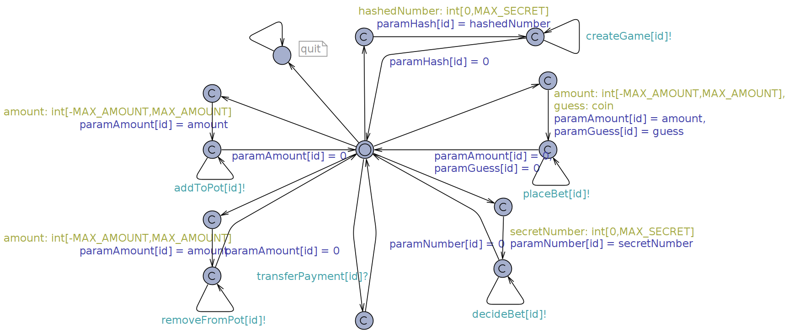
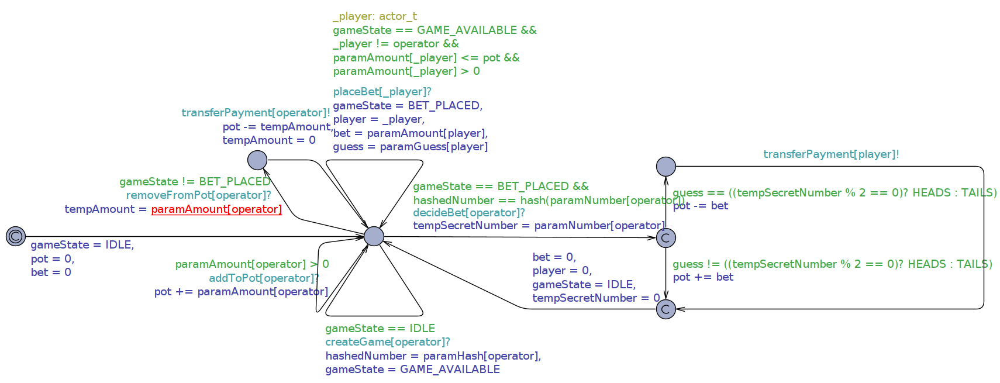

# Specifications for the Casino

**Currently under construction ...**

* [Original Solidity file](../SimpleCasino.sol)

* [Verified Solidity](Casino.sol), [Logfile of SLCVerify](slcverify-out.txt)

  
* Timed Automata (Uppaal)
 
    
    

    > The "direct" versions are closely based on the source code, the
    >     "state" versions on the state chart. The versions without
    >     overflow protection model the system with all its flaws,
    >     while the versions with overflow protection at least prevent
    >     integer overflows and underflows, because Uppaal does not
    >     allow to check other properties while those are still
    >     possible.

  * [uppaal/DirectCasinoOverflowProtection.xml](uppaal/DirectCasinoOverflowProtection.xml)
  * [uppaal/DirectCasino.xml](uppaal/DirectCasino.xml)
  * [uppaal/StateCasinoOverflowProtection.xml](uppaal/StateCasinoOverflowProtection.xml)
  * [uppaal/StateCasino.xml](uppaal/StateCasino.xml)
  
* Temporal Logic of Actions (TLA)
  * [Casino.tla](Casino.tla)
  
* Translation to C
  * [Casino.c](Casino.c)
  
